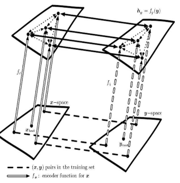
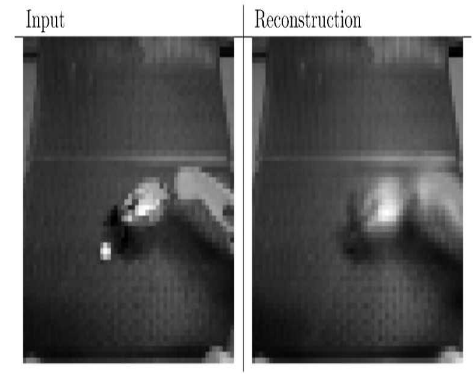
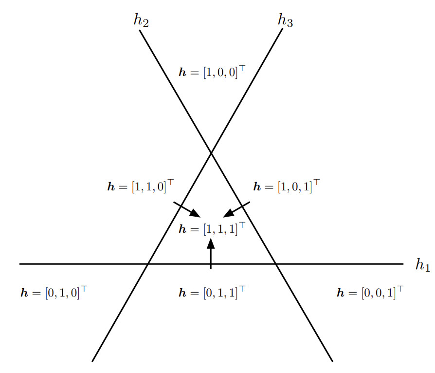

# 15. Representative-learning

## Intro

Hypothesis

: Unlabeled data can be used to learn a good representation.

- Supervised & semi-supervised & unsupervised learning
  - Supervised learning:
    - Training with supervised learning techniques on the labeled subset often results in severe overfitting.
  - semi-supervised learning:
    - Also learning from the unlabeled data
    - learn good representations -> unlabeled data: Possible

## 15.1 Greedy Layer-Wise Unsupervised Pretraining

- A representation learned for one task can sometimes be useful for another task(SL).
  - Unsupervised Pretraining -> Train a DSN(deep supervised network) without convolution or recurrence

### Compose

- Layer -> pretrained by unspervised learning -> simpler output for next Layer
  - A single-layer representation learning algorithm
    - RBM
  - A single-layer autoencoder
  - A sparse coding model

### Effect

(there are some citations in the book)

- Sidestep the difficulty of jointly training the layers of NNs(supervised task)
  - **Initialization** for a joint learning
    - Even fully-connected architectures
    - for other unsupervised learning algorithms:
      - deep autoencoders, probabilistic models with many layers of latent variables
        - models above:
          - deep belief networks
          - deep  Boltzmann machines

### Interpretation

- **greedy**：optimizes each piece of the solution independently
- layer-wise: proceeds one layer while freezes the previous one(s)?
- unsupervised
- pretraining: the first step before joint fune-tuning
  - Regularizer(正则化) / parameter initialization
  - Common use of pretraining:
    - Pretraining
    - Supervised learning
      - training a classifier based on pretraining phase
      - or supervised fine-tuning

### Why Does Unsupervised Pretraining Work?

#### Combination of two different ideas

- Initial parameters -->> Regularizing effect on the model
  - Out-of-date idea: Local initialization -> Local Minimum
  - Now:
    - standard neural network  training procedures usually do not arrive at a critical point
    - Local-pretraining-initialization -> Inaccessible areas
  - Problems:
    - What unsupervising-pretrained parameters should be retained for supervised learning next?
      - UL + SL at the same time
        - Another reason: the **constraints** imposed by the output layer are naturally included from the start.
      - (or)Freezing the parameters for the feature extractors
  - But how unsupervised pretraining can act as a regularizer?
    - One hypothesis:
    > Pretraining encourages the learning algorithm to discover  features that relate to the underlying causes that generate the observed data.

- Learning input distribution helps **mapping** from inputs to outputs
  - basis: Features that are useful for the unsupervised task may also be useful for the supervised learning task
    - The effectiveness of features learned through unsupervised training heavily depends on the specific model architecture. For example, a top-layer linear classifier requires features that make the underlying classes linearly separable.

#### When the initial representation is poor, unsupervised will be more effective

- Example:
  - Word embeddings
    - Idea: Unsupervised pretraining as learning a representation.
    - One-hot vector representation: can't quantify **distance** between vectors
    - Embeddings: encode similarity -> better for processing words
  - Less labeled examples scenerios
    - Idea: Unsupervised pretraining as a regularizer.

#### When the function to be learned is extremely complicated, UP is more useful

> Unsupervised learning differs from regularizers like weight decay because it does not bias the learner toward discovering a simple function but rather toward discovering feature functions that are useful for the unsupervised learning task.

Complicated function is too much for regularizers like **weight decay**[^1].

### Application

- Improve classifiers & reduce test set errors
- Improve optimization
  - Why? --UP takes the parameters into a region that would otherwise be
inaccessible.
    - Why inaccessible?
      - gradient becomes small
      - early stop(to prevent overfitting)
      - the gradient is large but it is difficult to find a downhill step due to problems such as **stochasticity** or poor conditioning of the **Hessian**.
    - Pretraining reduces the variance of the estimation process,initializes neural network parameters into a region that they do not escape
      - results: more consistent

### Disadvantages

- Two separate training phases:
  - Too many hyperparameters -> Effects can't be predicted before the try
    - UL + SL without P: one single decisive parameter
  - Different hyperparameters in two phases：
    - Params -> Forward feedback -> Gradient calculate -> Backward feedback -> Update params

### Today

- Scale of labeled dataset:
  - Large & Medium: SL + **Dropout/batch normalization**
  - Small: Batesian methods

- Milestone effect:
  - SP for transfer learning -> Convolutional networks
  - Transfer learning and domain adaptation

## 15.2 Transfer Learning and Domain Adaptation

### Transfer Learning

UL for transfer learning:

learning a good feature space -> well-trained linear classifer from limited labeled examples

#### Forms

##### One-shot learning

- One labeled example -> Learning a good feature space -> Infering all cluster around the same point
  - variation
  - invariation(clustered)

##### Zero-shot learning

- 3 random vars:
  - x
  - y
  - T(description of tasks)
    - > If we have a training set containing unsupervised examples of objects that live in the same space as T, we may be able to infer the meaning of unseen instances of T.
    - T needs generalization: can't be one-hot code
- Jointly learning:
  - representation_1 in space A
  - representation_2 in space B
  - relations between 1 and 2 or A and B
    - Take advantage of related respective feature vectors
- Related: Multi-modal learning

#### Input semantics

Representation learning -> transfer learning, multi-task learning, and domain adaptation.

- e.g. Visual Categories: low-level notions of edges and visual shapes sharing

#### Output semantics

Task-specific lower-level + Shared upper-level

### Domain adaptation

- e.g. Sentiment analysis(data from web)
  - vocabulary and style vary from domains
- concept drift: a form of transfer learning

### Multi-task learning

- Typically refers to SL, also for UL or RL(reinforcement).
- the same representation may be useful in both settings <--> representation benefits from both tasks

## 15.3 Semi-Supervised Disentangling of Causal Factors

### What makes one representation better than another?

#### Better representation

> The features within the representation correspond to the underlying causes of the observed data, with separate features or directions in feature space corresponding to different causes, so that the representation disentangles the causes from one another.

- Better p(x) -> Better p(y|x).

> A representation that cleanly separates the underlying causal factors may not necessarily be one that is easy to model.

!P744-数学公式

- In practice: Is Brute force solution possible?
  - BFS:Captures all h_j and disentangles them, then predict y from h.
    - Can'tcapture all factors of variation
  - What to encode?
    - SL + UL Signals
    - Only UL with larger representations

#### Definition Modifying

- Fixed criterion: mean squared error
  - failed when identifying "less" salient elements, like small ping-pong ball
- Solution: **GAN(generative adversarial networks)**(Are there more state-of-the-art solutions nowadays?)
  - What's salient element? -all structured pattern that the **feedforward network** can recognize.
  - GAN helps learning the underlying causal factors.
    - Benefit: x-effect; y-cause; **modeling p(x | y) is robust to changes in p(y)**.
    - Or: the causal mechanisms remain invariant, while the **marginal distribution** can change.

## 15.4 Distributed Representation

### Distributed Representation

- n features with k values -> k ^ n concepts
  - Neural nerworks
  - Probabilistic models
  - **Deep learning algorithm**
    - Hidden units can learn to represent the underlying causal factors
    - **non-distributed-representation-based**:
      - Clustering methods(k-means): 1 input point -> 1 cluster
      - k-nearest neighbors algorithms: more than 1 templates -> 1 input
        - Discribing values can't be controlled separately
      - Decision trees
      - Gaussian mixtures and mixtures of experts
      - Kernel machines with a Gaussian kernel
        - continuous-valued activation
      - N-grams LM
        - Tree-structure of suffixes -> partition the set of contexts (sequences of symbols)
- Example: Thresholding functions -> binary features
  - 
  - How many regions are generated by an  arrangement of n hyperplanes in R_d ?
    - Distinguished regions(input size): exponential
    - Hidden units: polynomial

#### Non-distributed representation

##### Symbolic representation

- Input is associated with a single symbol or category
  - or: one-hot representation
    - n bits binary vector & mutually exclusive

#### Why DR has statistical advantage over NDR?(Why DR generalize better?)

- Generalization arises due to **shared attributes**
  - a rich similarity space(better than one-hot representations)
- NDR is generalized due to **smoothness assumption**
  - Probs:**curse of dimensionality**(overfitting?)
- DR: **Capacity remains limited** despite being able to distinctly encode so many different regions

##### Summary

1. Less params and examples -> More efficiently partitioning the input space
   1. DR: k params -> r regions, k << r
   2. NDR: O(r) params -> r regions

2. Another logic-chain:
   1. **Limited Capacity Despite High Encoding Ability**:
      - Although distributed representation models (e.g., neural networks with linear threshold units) can encode a vast number of regions in input space, their capacity to generalize is still limited.
      - The VC dimension (which measures a model's complexity) of a neural network with linear threshold units is \( O(w \log w) \), where \( w \) is the number of weights. This means that even though the model can represent many regions, it cannot use all possible codes in the representation space.
   2. **Inefficiency of Fully Utilizing Code Space**:
      - Not all codes in the representation space can be fully utilized. This limits the ability of linear classifiers to learn arbitrary mappings from the representation space \( h \) to the output \( y \).

   3. **Prior Assumptions**:
      - The use of distributed representation combined with a linear classifier implies a prior belief: the classes we aim to distinguish are linearly separable under the underlying causal factors represented by \( h \).

   4. **Examples of Linearly Separable Classes**:
      - We usually want to learn classes like "all images of green objects" or "all images of cars," which can be represented in a linearly separable manner.
      - However, we don't typically need to distinguish classes requiring complex non-linear separations, like using XOR logic (e.g., grouping "red cars and green trucks" into one class, and "green cars and red trucks" into another).

      > So, although distributed representations can encode many distinct regions, the capacity of the model (such as the VC dimension) is limited. Additionally, since we typically assume that the classes we want to distinguish are linearly separable, linear classifiers cannot fully utilize the entire representation space. As a result, models based on distributed representations generalize more effectively while avoiding the need for complex nonlinear classification problems.

#### Experiment(rather than abstract ideas)

- Learning about each of feature without having to see all the configurations of all the others.
  - Hidden space:
  - > No need to have labels for the hidden unit classifiers: gradient descent on an objective function of interest naturally learns semantically interesting features.

## 15.5 Exponential Gains from Depth

### Statistical efficiency

- Multilayer preceptrons: shallow networks -> Exponentially smaller deep networks -> improved statistical efficiency

- Non-linear-relationship: Deep distributed representations
- Distributed representation + a hierarchy of reused features + Computation through the composition of nonlinearities -> **Exponential boost to statistical efficiency**

### Universal approximator

> UA(a Model family) + enough hidden units -> approximate all continuous functions up to any non-zero tolerance level

- **Deterministic feedforward networks** -> Functions
- **Restricted Boltzmann machines and deep belief networks**: -> probability distributions

### Deep feedforward network

Exponential ad over shallow nn.

#### SPN(sum-product network)

> There exist  probability distributions for which a minimum depth of SPN is required to avoid needing an exponentially large model.
> There are significant differences between every two finite depths of SPN, and that some of the constraints used to make SPNs tractable may limit their representational power.

## 15.6 Providing Clues to Discover Underlying Causes

> What makes one representation better than another?
> Disentangles the underlying causal factors of variation that generated the data.

- Labeled data: SL
- Unlabeled data: Representive learning
  - less direct hint -> make use of abundant unlabeled data
  - hint: forced implicit prior beliefs by designers

### Generic regularization strategies list

- Smoothness
  - Assumption: f (x + ed) « f (x) for unit d and small e
  - Ad: Generalize from points to nearby points of x
  - Disad: Curse of Dimensionality
- Linearity
  - Assumption: linear variables
  - Ad: Could make predictions even very far from the observed data
  - Disad: (maybe) Over-fitting
- Multiple explanatory factors
  - Assumption: Data is generated by multiple underlying explanatory factors
  - Motivation:
    - Semi-supervised learning via representation learning(15.3)
    - Distributed representations(15.4)
- Causal factors
  - Assumption: Feature(representation) h -> observed data x
  - Ad: makes semi-supervised learning models more robust when facing **Distribution drift** or a new task
- Depth, or a hierarchical organization of explanatory factors
  - Core: Hierarchy of concepts
  - Multi-step program: Chain structure
- Shared factors across tasks
  - Assumption: Each y^ is associated with a different subset from a  common pool of relevant factors h
    - Subsets overlap -> shared intermediate representation P(h | x) -> shared statistical strength -> effiency
- Manifolds
  - Assumption: Probability mass concentrates, and the regions in which it concentrates are locally connected and occupy a tiny volume.
  - Ad: when continuous, regions can be approximated low-dimensionally
  - Application: Autoencoders
- Natural clustering
  - Assumption: each connected manifold in the input space may be assigned to a single class
  - Activate: tangent propagation, double backprop, the manifold tangent classifier and adversarial training
- Temporal and spatial coherence
  - Assumption: Most important explanatory factors change slowly over time
- Sparsity
  - Assumption: Most features should presumably not be relevant to
describing most inputs.
  - Conclusion: Any feature that can be interpreted as “present” or “absent” should be absent most of the time.
- Simplicity of Factor Dependencies
  - In good high-level representations, the factors are related to each other through simple dependencies, like marginal independence.
