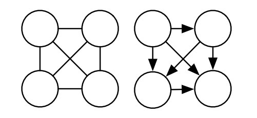

# 16. 结构化概率模型

## (一) 非结构化建模的挑战

### 概率模型的任务

- **估计密度函数**
  - 给定一个输入 x，机器学习系统返回一个对数据生成分布的真实密度函数 p(x) 的估计。
- **去噪**
  - 给定一个受损的或者观察有误的输入数据 x ，机器学习系统返回一个对原始的真实 x 的估计。
- **缺失值的填补**
  - 给定 x 的某些元素作为观察值，模型被要求返回**部分或全部未观察值**的估计/概率分布。
- **采样**
  - 模型从分布 p(x) 中抽取新的样本。

### 概率模型存在的问题

主要表现在面对**大规模随机变量**时。

#### 内存开销

- 假设x的分布为：n个离散变量，每个变量可取k个值。则可用含有$k^n$项的表格(或Python中的多维数组/字典)表示 P(x)。

一段简单的python代码示例。

```python
import itertools
import random
import time
import psutil
import os

n = 15 # 变量个数
k = 2 # 每个变量可以取的值的个数

start_time = time.time()
process = psutil.Process(os.getpid())
start_memory = process.memory_info().rss / (1024 * 1024)

P = {}
# 生成所有可能的组合并赋予随机概率
for combo in itertools.product(range(k), repeat=n):
    P[combo] = random.random()

end_time = time.time()
end_memory = process.memory_info().rss / (1024 * 1024)

execution_time = end_time - start_time
memory_usage = end_memory - start_memory

print(f"建立表格的时间开销: {execution_time:.6f} 秒")
print(f"建立表格的内存开销: {memory_usage:.6f} MB")

print("\n部分联合分布:") # 仅输出前5项
for i, (key, value) in enumerate(P.items()):
    print(f"P{key} = {value:.6f}")
    if i >= 4:
        break
```

#### 统计开销

#### 推理开销

#### 采样开销

P506

## (二) 使用图描述模型结构

### 16.2.1 图论

在学习**结构化概率模型**之前，了解**图论**的相关知识非常重要，因为很多概率模型（如**贝叶斯网络**和**马尔可夫随机场**）都可以用图来表示。图论是研究图这种数学结构的学科，图论中的概念为我们描述和分析复杂的概率关系提供了有力工具。

#### 基本概念

1. **图（Graph）**：由**节点**（vertices）和**边**（edges）组成，表示对象及其关系。
   - **有向图**：边有方向，表示单向关系。
   - **无向图**：边无方向，表示双向关系。

2. **节点（Node/Vertex）**：图中的基本元素，代表个体或变量。

3. **边（Edge）**：连接节点的线，表示节点间的关系。

4. **邻居（Neighbors）**：通过边相连的节点，表示两个变量直接相关。

5. **路径（Path）**：从一个节点到另一个节点的连接方式。

6. **环（Cycle）**：路径起点和终点是同一个节点。

#### 图的类型

1. **有向无环图（Directed Acyclic Graph, DAG）**：
   - **DAG** 是一种没有环的有向图。在概率模型中，DAG 通常用于构建**贝叶斯网络**。每个节点表示一个随机变量，有向边表示因果关系或条件依赖关系。
   - **无环性**意味着从一个节点出发，无法通过有向边返回该节点。

2. **无向图（Undirected Graph）**：
   - 无向图的边没有方向，常用于**马尔可夫随机场（Markov Random Field, MRF）**等模型。边表示两个节点之间的对称依赖关系。

#### 图的相关概念在结构化概率模型中的应用

1. **贝叶斯网络（Bayesian Network）**：
   - 是一种使用有向无环图（DAG）表示的结构化概率模型。每个节点表示一个随机变量，每条有向边表示条件依赖关系。贝叶斯网络通过结构化的方式刻画了变量之间的条件独立性。

2. **马尔可夫随机场（Markov Random Field, MRF）**：
   - 是一种使用无向图表示的结构化概率模型。每个节点表示随机变量，边表示变量之间的相互依赖。无向图表示变量之间的联合概率分布和无条件的依赖关系。

### 16.2.2 有向模型(Directed Model)

- 可视化参数减少量
为什么是k-1?

### 16.2.3 无向模型(Undirected Model)

所有边均无方向，也称为**马尔科夫随机场/马尔科夫网络**。无向图模型不直接表示变量之间的**因果关系**，而是强调它们的**直接相互作用**。

#### 团（Clique）与团势能（Clique Potential）

在无向图中，一个**团**（clique）是节点的一个**完全连接子集**，意味着子集中任意两个节点之间都有一条边。

每个团都有一个对应的**因子**（factor）或**团势能**（clique potential）\( \phi(C) \)，用于衡量团中变量每一种可能的联合状态的**密切程度**。因子/团势能均被限制为**非负的**。

例如，考虑一个描述你、你的室友和同事健康状况的模型。假设你们之间存在感冒的传播，你和室友之间、你和同事之间都有可能相互感染。在这种情况下，团的因子可以用一个表来定义，其中状态 1 代表健康，状态 0 代表感染。这样的设计使得健康状态的联合概率最大，而单个人生病的情况则是较低的概率。

#### 未归一化概率函数(Unnormalized probability function)

##### 定义

$$
\tilde{p}(x) = \prod_{C \in G} \phi(C)
$$
其中$\phi(C)$表示上文提到的**因子/团势能**。

？？？##### 为什么需要未归一化概率函数？

未归一化概率函数在无向图模型中起到**连接复杂概率关系和实际应用**的**桥梁**作用。

这个函数为给定的变量状态 \( x \) 提供了一种方式来计算联合概率。然而，由于未归一化的概率函数不能保证所有概率之和为 1，因此需要进行归一化处理。

#### 配分函数与归一化

为了确保模型输出有效的概率分布，我们需要使用**配分函数**（partition function）\( Z \)，它确保所有的概率之和或积分为 1：
$$
p(x) = \frac{1}{Z} \tilde{p}(x)
$$
其中，配分函数 \( Z \) 通常通过对所有可能状态 \( x \) 的联合分布空间求和或积分得到：
$$
{Z} = \int \tilde{p}(x) \, \mathbb{d}x
$$
在实际应用中，计算 \( Z \) 可能非常复杂。为此，我们需要设计**模型的结构和因子的定义**，使得 \( Z \) 的计算尽可能高效。

#### 基于能量的模型(Energy-based model,EBM)

$$
\tilde{p}(x) = \exp(-E(x))
$$

$E(x)$：能量函数(Energy function)，显然$\tilde{p}(x)$恒正。符合上式的分布可被称为**玻尔兹曼分布(Boltzmann distribution)**，具有该分布的模型被称为**玻尔兹曼机(Boltzmann Machine)。**没有**潜变量**(**latent variables**，在模型中不可观测的隐含特征或状态，如模型学习到的潜在特征或结构)的玻尔兹曼机被称为**马尔可夫随机场**或**对数线性模型**。

##### 专家(Expert)

根据$$\exp(a + b) = \exp(a) \cdot \exp(b)$$，能量函数可被拆为$\exp(a)$,$\exp(b)$等**多个项**，对应无向模型中的**不同团**，每个团都可被视为一个“**专家**”，决定一个特定的软约束是否能够被满足；每个专家执行的一个约束，对应随机变量的一个**低维投影**。不同专家的乘法，共同构成了复杂的高维约束。

例如书中的无向图模型：$E_{a,b}(a, b)$,$E_{b,c}(b, c)$等均可被视为不同“专家”，所有专家/项共同构成整体能量函数$E(a,b,c,d,e,f)$。
$$
E(a, b, c, d, e, f) = E_{a,b}(a, b) + E_{b,c}(b, c) + E_{a,d}(a, d) + E_{b,e}(b, e) + E_{e,f}(e, f)
$$


#### 无向图如何表示间接相互的变量？

！！！！

### 16.2.4 有向模型和无向模型的转换

#### 图模型的期望

既能捕捉到足够的独立性信息，又不引入虚假的独立性假设，**平衡复杂性和独立性**。

##### 最坏情况：完全图

完全图假设**所有变量之间都有相互作用**。虽然能够表示**任意概率分布**，但它并不能有效利用独立性信息，从而无法**简化**模型。

- 有向模型中的完全图(右)：排序变量->确保每个变量的父节点都是排在它之前的节点。排序方式不唯一。
- 无向模型中的完全图(左)：相当于一个**团**。



#### 有向<->无向模型互化

##### **有向模型->无向模型：道德化（Moralization）**

- **不道德(immorality)**：a与b同为c的父节点，但a与b相互独立。
  - `a->c && b->c && !(a->b || b->a)`
- 道德化：
  - 对于有向图中的每一对父节点，如果它们没有直接边相连，就在无向图中为它们添加一条无向边。
    - 添加无向边->丢失独立性，引入新的直接依赖
  - 移除有向边的方向，使图成为无向图。


##### **无向模型->有向模型：三角形化（Triangulation）**

###### **概念**

- 环(loop)：a-b-c-d-a
- 弦(chord)：环中任意两个**非连续变量**之间的连接(如a-c,b-d)
  - a-b-c-d-a && (**a-c || b-d**)

###### **转化方法**

1. 确保无向图中的每一个**长度大于3的环**都有弦，即**任意两个不相邻的节点通过一条额外的边相连**。不满足该条件的环，需要首先添加弦，才能进行下一步；添加弦后的图被称为“弦图”(chordal graph)或“三角形化图”(triangulated graph)。
2. 为每条边指定方向，根据节点排序顺序构建有向图，注意应保证**不能在转化后的有向图中产生有向循环**(如a->b->c->a)。


###### **为什么要保证有向图中不能出现有向循环？**

- 有向概率模型要求所有变量的依赖关系必须可以表示为有向无环图（DAG），出现有向循环（反馈环路）将导致无法定义有效的**联合概率分布**；
  - 联合概率分布的定义依赖于**无环性**：
    - 有向概率模型使用**链式规则**来定义联合概率分布。对于每个变量 \(X_i\)，其条件概率 \(P(X_i | \text{Parents}(X_i))\) 依赖于它的父节点。如果存在循环，这意味着某个变量的条件概率会依赖于自己或间接依赖于自己，导致**递归定义**，进而无法计算出有效的联合概率分布。
  - 同时，有向循环也破坏了DAG的**条件独立性**表达。DAG的优势在于，变量之间的条件独立性可以通过观察父节点关系或通过图中的路径来推导，有向循环导致这种**独立性关系**变得不再明确。
- 因此，必须确保有向图的**无环性**。

#### 有向模型和无向模型的抉择

- **任务需求**：有向模型更适合进行采样，无向模型更适合近似推断。

##### 采样任务

- 有向模型：**原始采样(Ancestral Sampling)**，通过**拓扑排序**排列模型中的变量，从无父节点的变量开始，依次根据条件概率采样。
  - **拓扑排序**：**确保父节点都在其子节点之前采样**，否则会出现错误。(联想：使用未初始化的局部变量是不可接受的)
    - 理论依据：联合分布的链式法则。$$P(x_1, x_2, \ldots, x_n) = \prod_{i=1}^{n} P(x_i \mid \text{Pa}(x_i))$$
  - 局限性：仅适用于有向图；难以获取**后验分布**(给定观测数据后，更新某些变量的概率分布)
- 无向模型：**Gibbs采样**
  - ？

##### 近似推断任务

请见19.56(原书)。

### 16.2.5 因子图(factor graph)

P522

在概率图模型的研究中，**无向模型**（也称为马尔科夫随机场）是广泛使用的一种方法，它通过图结构来表示一组变量的依赖关系。然而，在无向模型中，关于每个团（clique）的因子函数（即概率分布的非归一化版本）的定义常常会出现一些模糊性。例如，我们难以确定某个团是否对应一个整体的因子，还是多个较小因子。这时，**因子图（Factor Graph）**的出现帮助我们解决了这些问题。

## 1. 什么是因子图？

**因子图**是一种基于无向模型的特殊表示方式，它能够更清晰地展示模型中的因子和变量之间的依赖关系。与传统的无向图不同，因子图通过区分**变量节点**和**因子节点**，使得每一个因子的作用域能够被明确表示，从而避免了无向图中的模糊性。

- **变量节点**：表示随机变量，通常使用圆圈表示。
- **因子节点**：表示未归一化的概率分布函数 \( \phi \)，使用方块表示。

因子图是一个**二分图**（Bipartite Graph），变量节点和因子节点之间通过无向边连接。每一条边表示该变量被包含在该因子的作用范围内。一个关键点是：**变量节点不能直接连接到其他变量节点，因子节点也不能直接连接到其他因子节点**。这确保了图的结构能够明确地表达变量与因子之间的关系。

## 2. 为什么要用因子图？

在无向图中，特别是在处理较为复杂的团时，存在**团势能的模糊性**。例如，一个由三个变量 \( a \)、\( b \)、\( c \) 组成的团可以被解释为一个涉及三个变量的单一因子，也可以是三个两两变量间的因子组合。这种不确定性使得在推断和计算中难以确定最佳的计算方式。

因子图通过显式地表示每个因子的作用域，解决了这一问题。具体来说，因子图为我们提供了两个关键优势：

1. **消除模糊性**：每个因子节点明确指向其包含的变量，避免了因子作用域不清的问题。
2. **高效推断**：通过因子图的表示方式，可以更容易进行有效的计算推断。特别是在某些情况下，因子图可以将复杂的全局依赖关系分解为多个局部依赖，使得计算代价显著降低。

## 3. 因子图的实际应用

让我们通过一个具体的例子来说明因子图如何解决无向图中的模糊性。

### 例子：三变量模型

考虑一个无向图模型，它有三个变量 \( a \)、\( b \) 和 \( c \)，这些变量形成一个团（Clique），如图 16.13（左图）所示。在无向图中，这三个变量之间存在相互依赖，但是关于它们如何通过因子函数表示却存在不同可能性：

- **表示 1**（中图）：我们可以假设这三个变量由一个单一的因子 \( \phi_1 \) 来表示，该因子的作用域是 \( \{a, b, c\} \)，这表示 \( a \)、\( b \)、\( c \) 三者之间存在全局依赖关系。
  
- **表示 2**（右图）：另一种可能的解释是，三个变量通过多个局部的因子来表示。比如，我们可以假设存在三个因子 \( \phi_1 \)、\( \phi_2 \) 和 \( \phi_3 \)，每个因子只涉及两个变量（如 \( \phi_1 \) 作用于 \( a \) 和 \( b \)，\( \phi_2 \) 作用于 \( b \) 和 \( c \)，等等）。这种表示方式可以将全局依赖拆解为局部依赖，推断时计算代价较低。

通过因子图的方式（如图 16.13 中图和右图），我们能够更加灵活和明确地定义这些依赖关系，避免了模糊性问题，并为后续的概率推断和学习提供了便利。

## 4. 因子图的推断与学习

一旦明确了变量和因子的关系，因子图为概率推断和学习提供了强大的工具。常见的推断算法如**消息传递算法**（Message Passing Algorithms）和**贝叶斯网络推断**，都可以在因子图上实现。特别是，当模型中存在较多的局部依赖关系时，因子图能够显著降低计算成本。

此外，因子图在许多实际应用中得到了广泛使用，例如：
- **计算机视觉**：用于图像中的像素依赖建模。
- **自然语言处理**：用于词汇和语法结构的联合建模。
- **推荐系统**：建模用户和商品之间的相互依赖关系。

## (三) 结构化建模的优势

